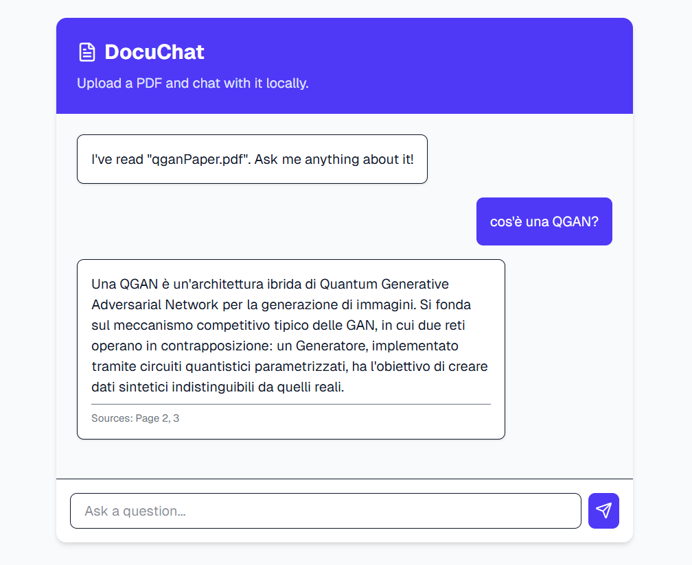

# 📄 DocuChat - Intelligent RAG Knowledge Base


> **DocuChat** is a RAG (Retrieval-Augmented Generation) platform that transforms static PDF documentation into an interactive conversational intelligence engine. The system allows users to chat with their documents to get instant answers with source citations.

---

## 📖 Table of Contents
- [Overview](#-overview)
- [Architecture and Technologies](#-architecture-and-technologies)
- [Key Features](#-key-features)
- [Interface](#-interface)
- [Installation and Setup](#-installation-and-setup)
- [Advanced Configuration](#-advanced-configuration)
- [Author](#-author)

---

## 🔭 Overview

The project was created to solve the problem of inefficient search in unstructured documentation. Companies drown in scattered data (manuals, legal contracts, HR policies), making it difficult to find specific answers without scrolling through hundreds of pages. DocuChat offers an intelligent solution that semantically understands documents and enables instant conversational searches.

### Key Strengths
* **Advanced Semantic Search:** Understands user intent beyond simple keyword matching, using vector embeddings.
* **Verifiable Citations:** Every AI response includes specific page numbers to ensure reliability and traceability of information.
* **Multilingual Support:** Fully capable of understanding and responding in Italian, English, and other major languages.

---

## 🛠 Architecture and Technologies

The system operates on a simplified two-phase pipeline: **Ingestion** (upload) and **Retrieval** (RAG retrieval), implementing a modern and scalable architecture.

### Backend (AI Stack)
* **Framework:** Next.js 14 with **App Router** and Server Actions.
* **AI Orchestration:** **LangChain** for RAG chain management and AI operations.
* **Vector Database:** **Pinecone** for high-speed semantic search with Namespaces for data isolation.
* **LLM:** **Google Gemini** (`gemini-1.5-flash` default, compatible with Free Tier).

### Frontend (Modern React)
* **Core:** Next.js 14 with **TypeScript** for type safety and maintainability.
* **UI & Styling:** Modern design system with intuitive drag-and-drop interface.
* **Real-time Chat:** Conversational messaging system with streaming responses.

---

## ✨ Key Features

### 📤 Upload and Ingestion
* **Drag & Drop Interface:** Intuitive upload of PDF documents.
* **Processing Pipeline:** The PDF is cleaned, split into text chunks, converted into mathematical vectors (embeddings), and stored in Pinecone.
* **Document Management:** Visualization and management of uploaded documents.

### 💬 Conversational Chat
* **Context-Aware Retrieval:** When a user asks a question, the system searches Pinecone for the most relevant chunks and sends them to Gemini AI to generate an accurate response.
* **Source Citations:** Every response includes specific references to pages in the original document.
* **Multilingual Support:** You can upload a manual in English and ask questions in Italian: the AI will automatically translate and synthesize the response.

### 🔒 Data Isolation
* **Namespace Management:** Uses Pinecone Namespaces to ensure searches are strictly limited to the specific document being viewed.
* **Secure Storage:** Embeddings stored securely with controlled access.

---

## 📸 Interface


### Chat Interface
Real-time Q&A with source page citations.



---

## 💻 Installation and Setup

Follow these steps to run the application locally.

### Prerequisites
* **Node.js 18+**
* **Google AI Studio Account** (for Gemini API - Free Tier available)
* **Pinecone Account** (Free Tier available)

### 1. External Services Configuration
Before starting, make sure you have:
* **Google AI API Key:** Get the key from [Google AI Studio](https://ai.google.dev/)
* **Pinecone Setup:**
  - Create an account on [Pinecone](https://www.pinecone.io/)
  - Create a new Index with:
    - **Name:** `docuchat-index`
    - **Dimensions:** 768
    - **Metric:** Cosine

### 2. Repository Clone
```bash
git clone https://github.com/DawsonPeek/docuchat.git
cd docuchat

# Install dependencies
npm install
```

### 3. Environment Configuration
Create a `.env.local` file in the root directory:

```env
# Google AI Studio (Gemini)
GOOGLE_API_KEY=your_google_api_key_here

# Pinecone Vector DB
PINECONE_API_KEY=your_pinecone_api_key_here
PINECONE_INDEX=docuchat-index
```

### 4. Starting the Application
```bash
npm run dev
```

The application will be accessible at `http://localhost:3000`.

---

## 🔧 Advanced Configuration

### Upgrade to Gemini Pro
The project uses `gemini-1.5-flash` by default (free). Users with paid Google Cloud plans can switch to `gemini-1.5-pro` for superior reasoning capabilities by modifying the configuration.

---

## 📬 Author

[GitHub Profile](https://github.com/DawsonPeek)

---

<p align="center">Made with ❤️ using Next.js 14 & Google Gemini</p>
